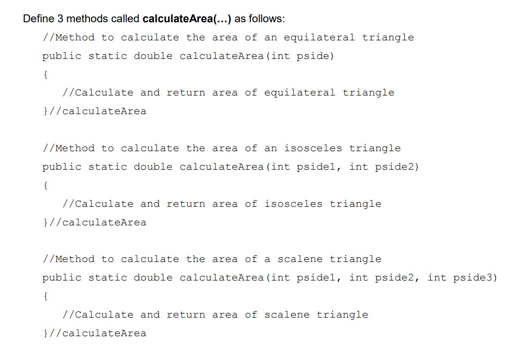
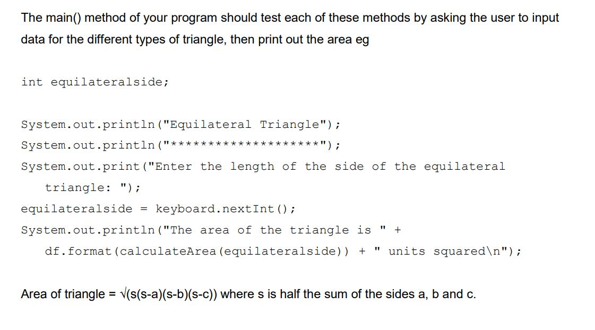

# Instructions  

  ** Write a Java application called MethodOverloading.java which will demonstrate method
overloading - how the same method identifier can be used with different signatures.**

 

  

 

   
   
  